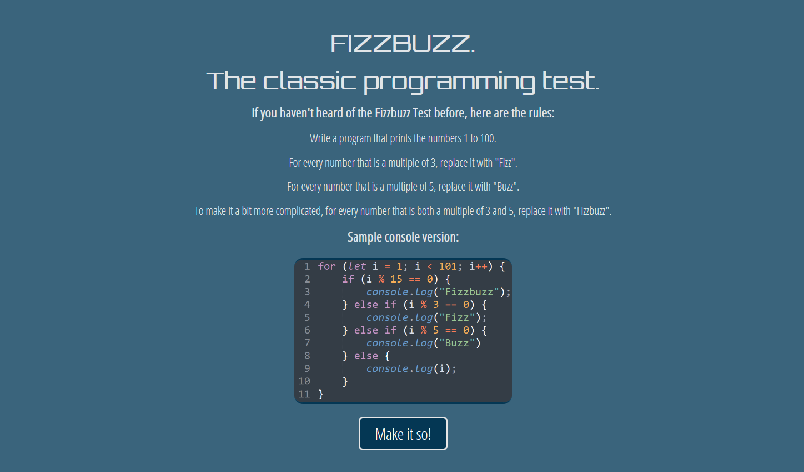

# OTT Fizzbuzz
###### The answer to the question nobody was asking - "What would the Fizzbuzz test look like with pointless CSS animations?"
 
The [Fizzbuzz](https://en.wikipedia.org/wiki/Fizz_buzz) test is famous/infamous for being used as a simple interview test question. I decided to see if I could make it a bit more interesting, and use it as a good base project to learn a bit more about CSS (including using simple animations).
 

 
## Possible Improvements:
- Responsive design. (Doesn't yet render properly on smaller screens).
- Improved animations.
- Customisable word substitutions and number range.
- Make way more OTT.